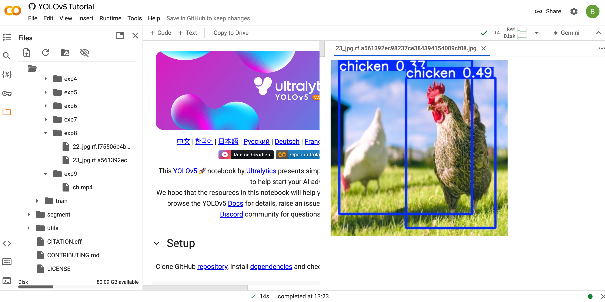

# ObjectDetection

## Using yolo V5

# Face and preson reco in v5
# Here i train the model using google colab download the model and download the yolo v5 complete data then add the app.py
/*************  ✨ Smart Paste 📚  *************/

/******  a4408572-d10d-4bef-bb3c-fc761ad1a565  *******/
